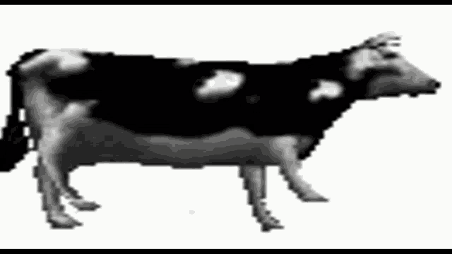

# Introduction

## Partial Credit Model
- Categorical item scores

## Fixed effects versus random effects

:::: {.columns}

::: {.column width="45%"}
Fixed effects

:::

::: {.column width="10%"}

:::

::: {.column width="45%"}
Random effects

:::

::::

## Example
{fig-align="center"}

## Joint marginal probability distribution
Let $\boldsymbol{Y}=(Y_1,\dots,Y_k)'$ be a vector of item scores and $\theta$ and estimate of a latent random variable. The joint marginal probability distribution of $\boldsymbol{Y}$.
 
\begin{aligned}
    P(\boldsymbol{Y}=\boldsymbol{y})&=\int P(\boldsymbol{Y}=\boldsymbol{y}|\theta)f(\theta)d\theta \\
    P(\boldsymbol{Y}=\boldsymbol{y})&=\exp\left(\sum^k_{i=1}\sum^m_{s=1}\beta_{is}x_{is}\right)\int P(\boldsymbol{Y}=0|\theta)\exp\left(\theta y\right)f(\theta)d\theta,
\end{aligned}
where $\beta_{is}$ is a location parameter, $x_{is}$ is a dummy code for each category and $y$ is the total score.

## Example: Rasch model
A test with 3 items with 1 category @Hessen2025
```{r} 
#| echo: FALSE
#| cache: true
#| label: rasch
library(ltm)
# sample
N <- 10000

# latent variable
set.seed(13)
lv <- rnorm(N)

# probability of correct answer
prob1 <- exp(lv-log(0.25/0.75))/(1+exp(lv-log(0.25/0.75))) # 25% for average latent variable score
prob2 <- exp(lv)/(1+exp(lv)) # 50% for average latent variable score
prob3 <- exp(lv-log(0.90/0.10))/(1+exp(lv-log(0.90/0.10))) # 90% for average latent variable score

# choose outcome based on probability
x1 <- rbinom(n = N, size = 1, prob = prob1)
x2 <- rbinom(n = N, size = 1, prob = prob2)
x3 <- rbinom(n = N, size = 1, prob = prob3)

# plot rasch model
data <- data.frame(x1, x2, x3)
model1 <- rasch(data)
plot(model1)
```
## References
::: {#refs}
:::

# extra for markup assignment

## Moving picture


## code displayed but not executed
\`\`\`{r}

```
plot(1:10)
```

\`\`\`


## interactive table
```{r}
library(DT)
data %>% 
  datatable()
```
## renv
```{r}
library(renv)
renv::status()

```